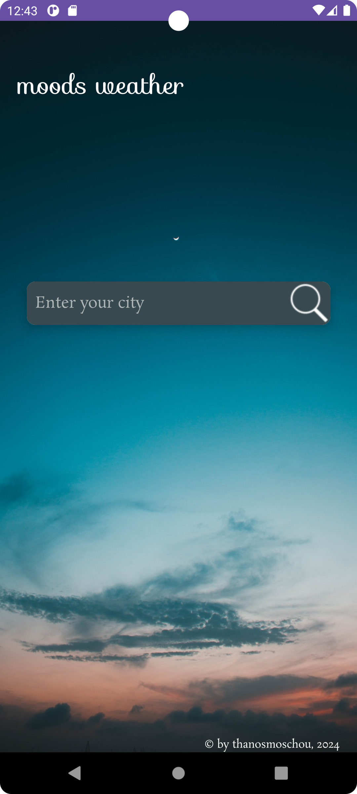
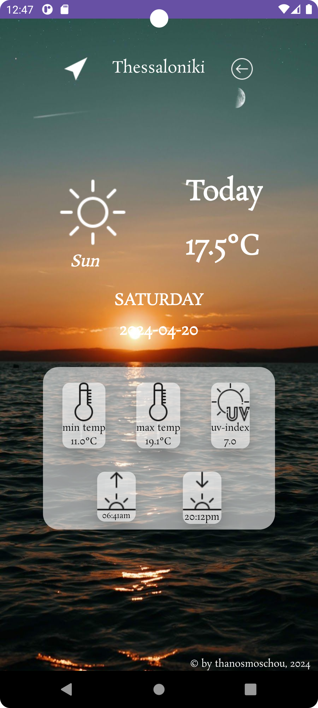
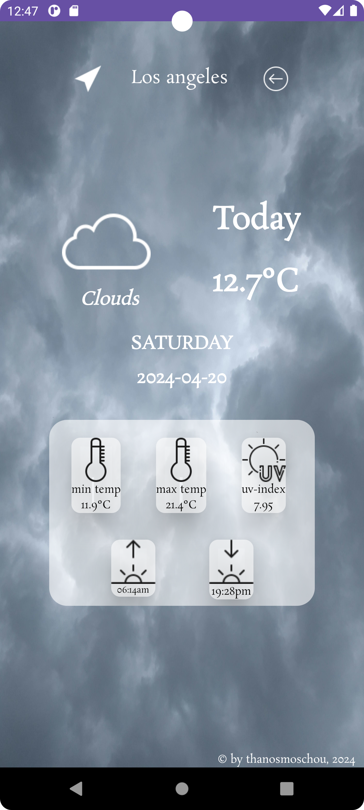
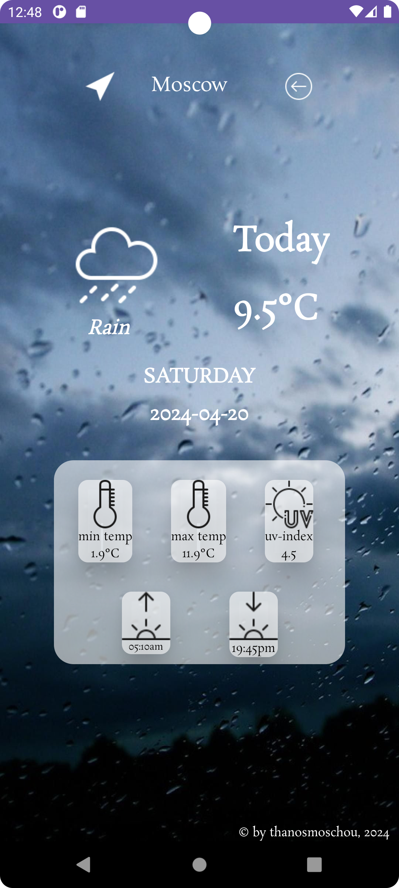

## Moods Weather
Did you know that weather has its own mood?  
Enter your city to find it!!  

### Screenshots
  
  
  
  

### How it works
Type the name of your city, press the search button and let the app show you the weather forecast!  
The app uses 2 apis to get the job done.  
The first api is the Geocoding API of https://www.open-meteo.com  
App sends a request to this api by providing a city's name and it gets back the longitude and the latitude of the city  
(First it receives a JSON response and it manipulates the JSON to get the longitude and the latitude).  
The second api is the Weather Forecast API of Open-Meteo.  
App makes a request providing the longitude and the latitude of a city and it gets back a JSON response. Finally by handling this JSON response 
it gets the weather info.